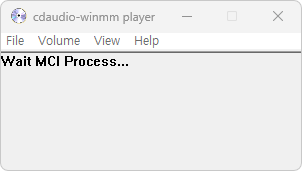

# mp3-wav-winmm player (v2.0 alpha)

This is a winmm wrapper that link tracks to mp3 or wav files for old programs trying to play tracks with a cdaudio device. (alternative "ogg-winmm", "_inmm")
Unlike the ogg-winmm wrapper that plays the ogg file, it uses the player in cdaudio-winmm to link tracks to an mp3 or wav file.
Communication between winmm.dll and the player is done using [mailslots.](https://docs.microsoft.com/en-us/windows/win32/ipc/mailslots)

Analyzing the mci command, it operates internally only if it is a request for cdaudio, and forwards the track playback and volume control commands to the player.
If there is a sound source file in a certain folder, the playback duration is analyzed through file search, enables the internal timer when a play request occurs to return the value for the MCI_TRACK_POSITION or MCI_LENGTH request with accuracy of around 200 ms.

Limitations:
- If the music file is not found, all tracks are reported as 2min 30secs long. This may cause issues if a game relies on an accurate response for the track length query in order to determine when the track has finished playing.
- The wrapper can not handle a situation where a game uses the MCI API to also play video files. In this case you will likely see a black screen or an error message.

### Changes to a new version
2.0.0(a) changes:
+ Built-in time calculation function for accurate playback time returns.
+ Added support for multiple cases.
+ Improved volume control support.
+ Multi-execution support.

#### - winmm.dll
  >New:   Code refactoring 
  >New:   Interlock all fake functions using Mutex 
  >Fixed: Resolves a problem that occurs when the exe file for music player is in the same folder. 
  >Fixed: Fixed an issue where auxGetVolume always returned a value of 0 rather than the current volume. 
  >Fixed: Fixed an issue with auxGetDevCapsA returning the supported volume to mono sound. 
  >Fixed: Fixed issue with inappropriate MM_MCINOTIFY Callback notification in MCI_PLAY. 
  >Fixed: Fixed issue with inappropriate MCI_MODE_PLAY return after play is complete in MCI_STATUS. 
  >Added: Rewrote the original u/hifi's winmm.def linker 
  >Added: Support for binary patched programs known as "_inmm" (Behavior when changing name "winmm.dll" to "_inmm.dll") 
  >Added: More added original u/YELLO-belly's function relay for the fake-functions 
  >Added: Configure standalone execution environment with DLL replication function (Behavior when winmm.win32.dll exists) 
  >Added: Add Current hWnd Finder with GetCurrentHWND() function 
  >Added: Add exe Path Finder with GetParentPath(LPTSTR) function 
  >Added: Add named exe Process Running Checker with FindProcess(LPTSTR) function 

#### - winmm_player.exe
  >New:   Code refactoring 
  >New:   Supports tray icon function and moves to tray icon when minimize 
  >New:   Support for multi-application execution 
  >Modify: Override function to master volume function by connecting auxSetVolume to mciSendString setaudio 
  >New:   Forced volume and Mute volume options 

### Changes to existing programs (dippy-dipper/cdaudio-winmm)
0.4.0.3 changes:
- Better no. of tracks logic. Should now work more reliably.
- Set player to always run on the last CPU core to fix issues with games set to run on single core affinity (e.g. Midtown Madness).
- Handle TMS time format (Driver).

Note: This may be the last maintenance release. Implementing support for games that switch between different time formats and use milliseconds to play a tracks from arbitrary position will require a full re-write of the logic. In addition a better wrapper is needed to only catch commands send to the cdaudio device and not swallow other commands that are meant for video playback for example. The latency with Mailslot communication is also proving difficult to manage as the logic becomes more complex.

0.4.0.2 changes:
- Using the waveaudio device for .wav file playback.
- Fix MCI_STATUS_POSITION for current track in TMSF (MidtownMadness Open1560 compatibility)

0.4.0.1 changes:
- Fixed a dgVoodoo2 ddraw.dll wrapper incompatibility issue with track repeats.

0.4 changes:
- Added "AutoClose" option in winmm.ini.
- MciSendCommand improvements from ogg-winmm project. Support for more games.
- MciSendString improvements copied from ogg-winmm.
- AuxVolume control enabled. (should use in-game volume sliders. Manual volume override available for problematic cases)
- SetCurrentDirectory fix for cdaudioplr.exe when started from winmm.dll.

0.3 changes:
- mp3/wav support
- cleared up some naming inconsistency

### Building:

All source files have been rewritten as a build environment for Visual Studio. (Created in VS2022)
Change build environment to x86 in Visual Studio and run build

### Usage:

- Place winmm.dll wrapper into the game folder.
- Place winmm_player.exe into the game folder.
- Place music folder into the game folder.
- Run the game normally.

### NOTE:
- Tested on LEAF games (ToHeart1, WhiteAlbum1)
